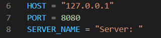
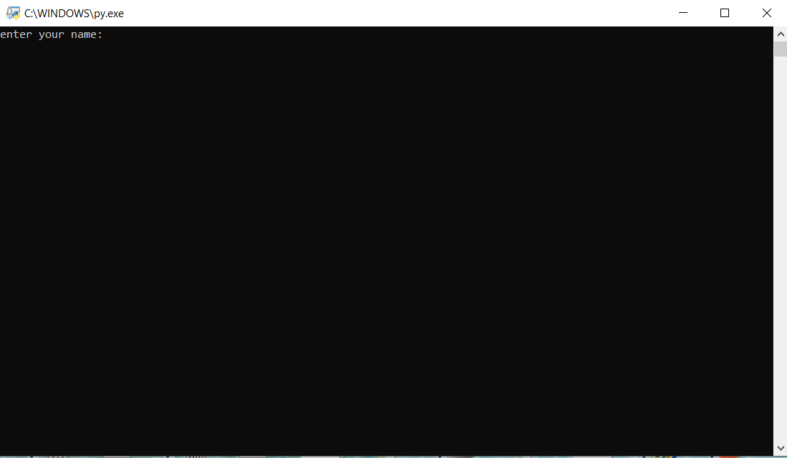
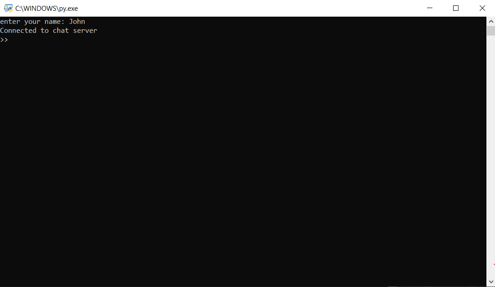
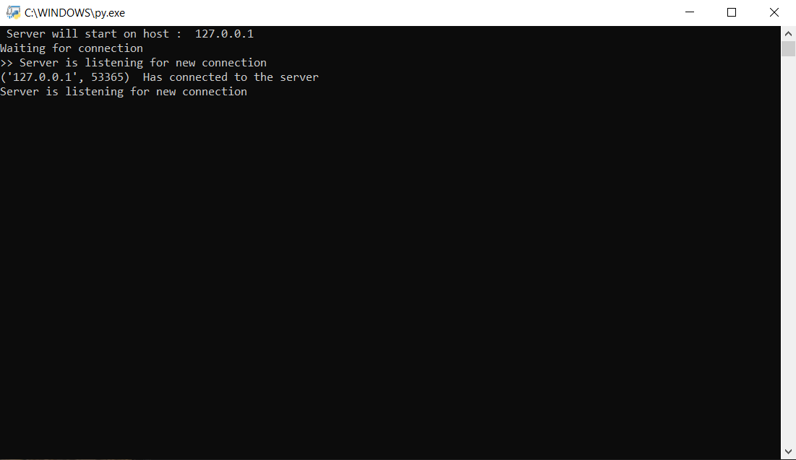
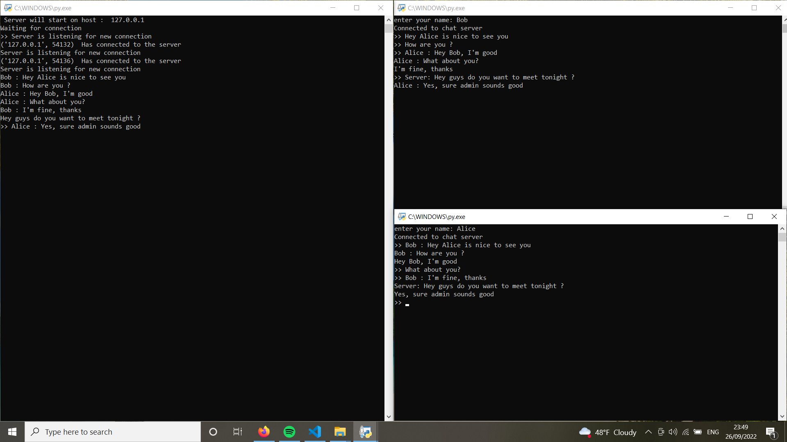
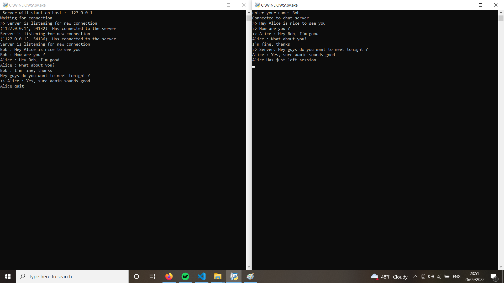

# Chat app
This is simple server-client chat application, which allows to communicate multiple users in the same time.
### Installing
To get this app just cimple copy this link below into your terminal.
```
git clone git@github.com:Alg1mantas/Chat_application.git
```

### About
This application is based on sockets library.  Chat allows you to comunicate between server and multiple clients to each other. Well I've only tested it on localhost, but in future I will test it on multiple different computers . And I will also add some extra features like end-to-end encryption, login etc. It's one of my first and most favourite project , so some bugs may appear. If you notice any bug or how I suppose to improve this code please contact me.

### Usage 
It's quite simple to use this application. At first you need to configurate app. In existing code both in server.py and client.py enter IP adress and port number. By default server IP: 127.0.0.1, Port: 8080 . If you are OK about default values it's not nessesary to configure it.



When configuration is done. Just start client.py or server.py After starting client.py you need to provide user name:



After providing user name client will connect to server

client.py:


server.py:


Now you can communicate to each other



If someone will leave chat , other users will get message:



If you want to exit chat application just type and press enter:

```
chatquit
```
If server side wants to know how many active users is online , type and press enter:

```
chatlist
```
